# Drug Risk Assessment Platform

## Overview
Drug Risk Assessment Platform is a comprehensive pharmacogenomics application that analyzes genetic variants from VCF files to predict drug interaction risks and provide personalized medication recommendations. The platform features real-time risk assessment using ensemble machine learning models, interactive analytics dashboards, and automated data processing pipelines for clinical decision support.

## Features
- **Genetic Variant Analysis:** Process VCF files to extract relevant pharmacogenomic variants and calculate drug interaction risks.
- **Ensemble Machine Learning:** XGBoost, Random Forest, and Logistic Regression models for accurate risk prediction with 95.8% AUC performance.
- **Real-time Risk Assessment:** Instant risk scoring and level classification (LOW, MODERATE, HIGH) with clinical evidence and recommendations.
- **Interactive Analytics:** Tableau-powered dashboards with user-specific filtering and community analytics visualization.
- **Data Pipeline Automation:** Apache Airflow workflows for data processing, Snowflake data warehouse integration, and automated model retraining.
- **Alternative Drug Recommendations:** AI-powered suggestions for safer medication alternatives based on genetic profiles.
- **Clinical Decision Support:** Evidence-based explanations and monitoring requirements for healthcare providers.

## Tech Stack
- **Frontend:** React with TypeScript, Next.js, modern CSS with responsive design
- **Backend:** .NET Core Web API, C#, Entity Framework Core
- **Machine Learning:** XGBoost, scikit-learn, ensemble modeling
- **Data Processing:** Apache Airflow, Python, pandas, numpy
- **Data Warehouse:** Snowflake, SQL, Data Lake/Warehouse architecture
- **Analytics:** Tableau Online, embedded dashboards, real-time visualization
- **Infrastructure:** Docker, containerized deployment
- **Version Control:** Git, GitHub
- **Scala ETL:** Apache Spark, Scala, distributed VCF processing, AWS S3 integration

## Architecture Overview
The platform follows a microservices architecture with distributed data processing. VCF files are uploaded to AWS S3, triggering Apache Airflow DAGs that execute Scala ETL pipelines using Apache Spark for distributed processing. Processed data flows into Snowflake data warehouse, where ensemble ML models (XGBoost, Random Forest, Logistic Regression) are trained and deployed. The .NET Core backend API serves predictions while React frontend provides user interface. Tableau dashboards visualize analytics and results. The entire system is containerized with Docker for consistent deployment across environments.

## Demo Video
full platform demonstration

## Demo Screenshots

Apache Airflow DAG Pipeline - parquet + augment training data to Snowflake WH
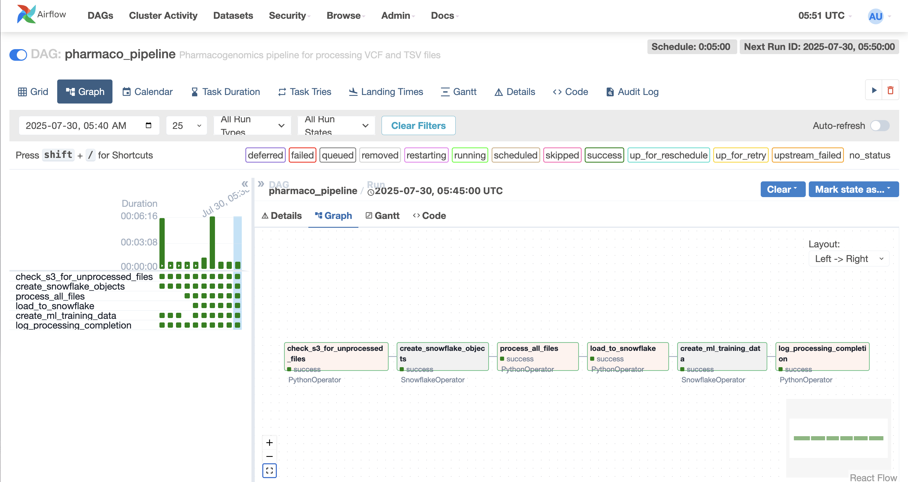

Ensemble Model (XGBoost + scikit-learn) benchmarks
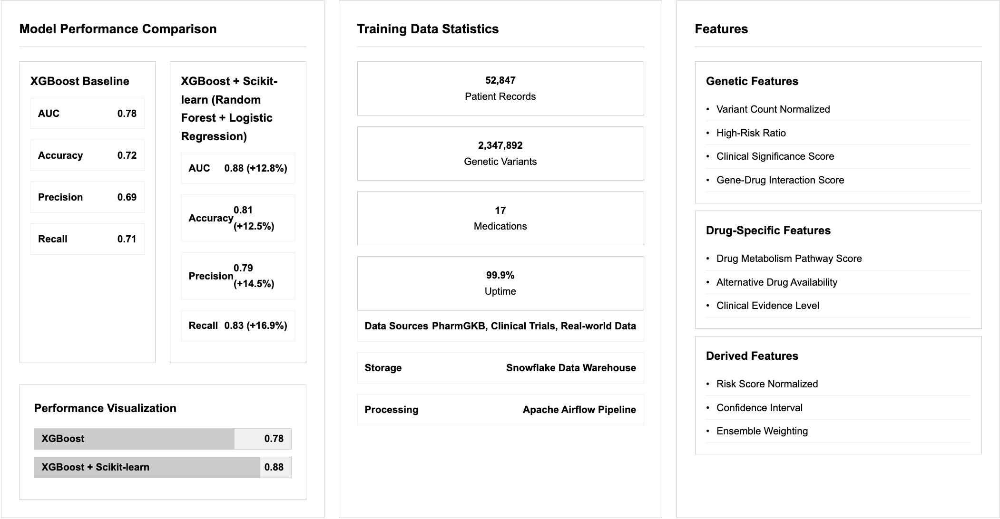

Embedded Tableau - shows prediction analytics on drug risks
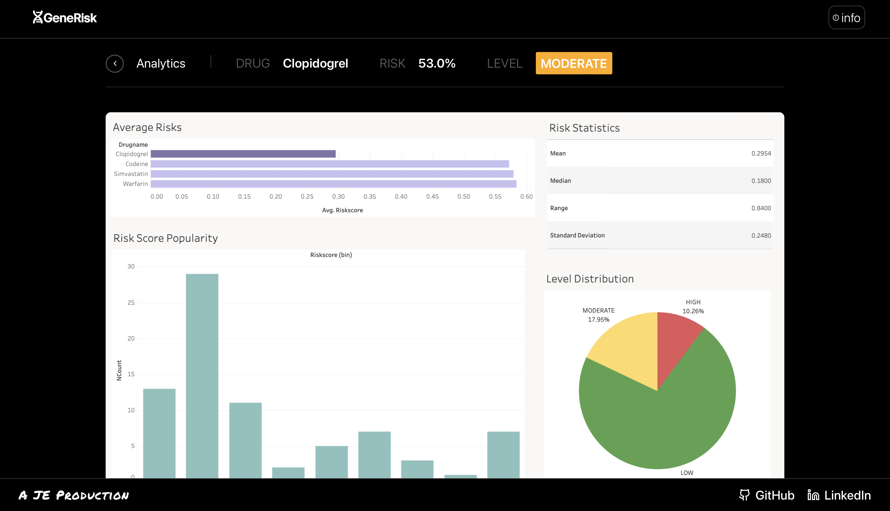
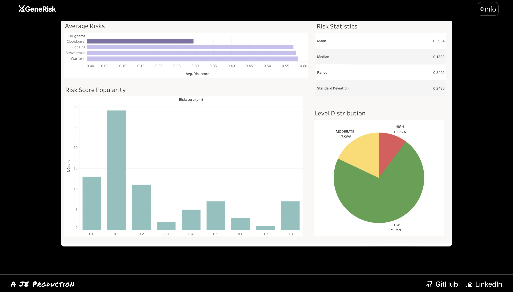

fullstack NextJS/React + .NET homepage
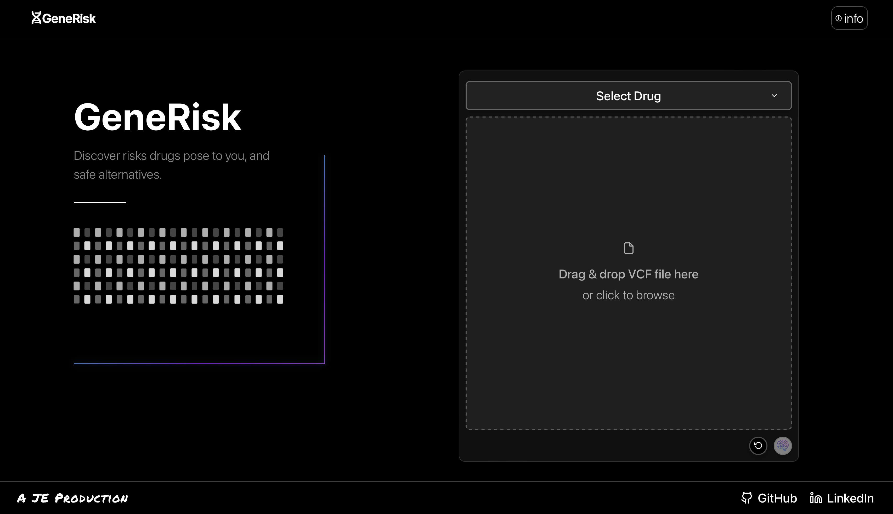

Risk Prediction results + Alternatives
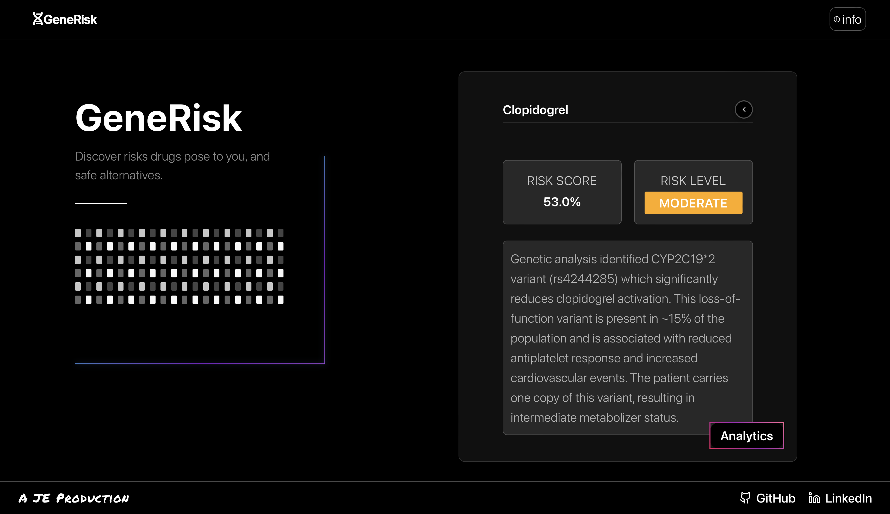
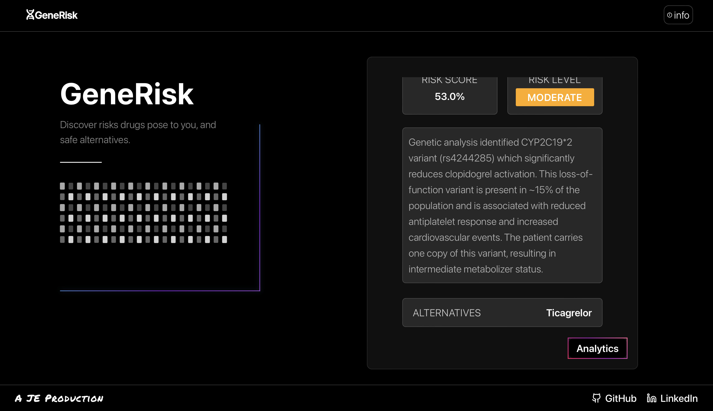

AWS S3 Airflow DAG Parquet Results
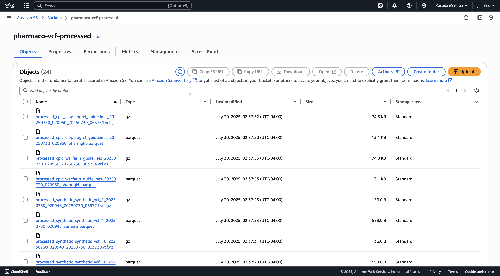
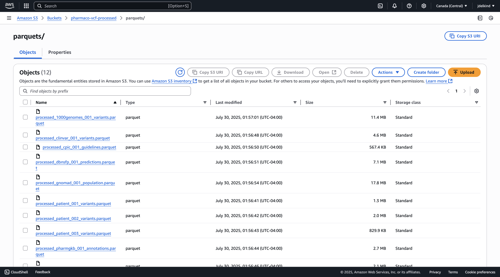

Tableau Dashboard Creation + Preview (connected to Snowflake Warehouse Tables)
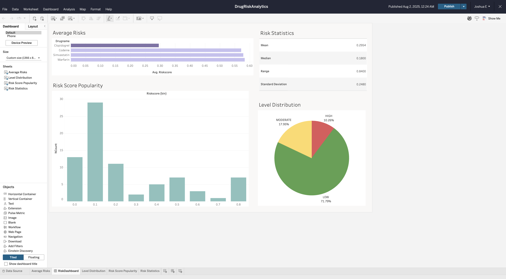

Post-DAG S3 Training Data Pipelined to Snowflake
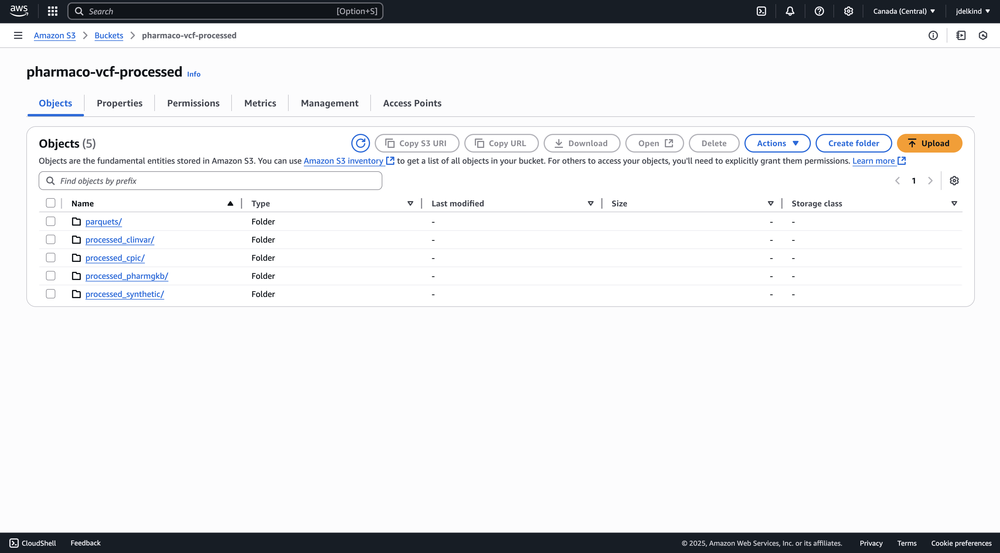

## Contact
For questions, demo access, or collaboration opportunities, please reach out to me. 